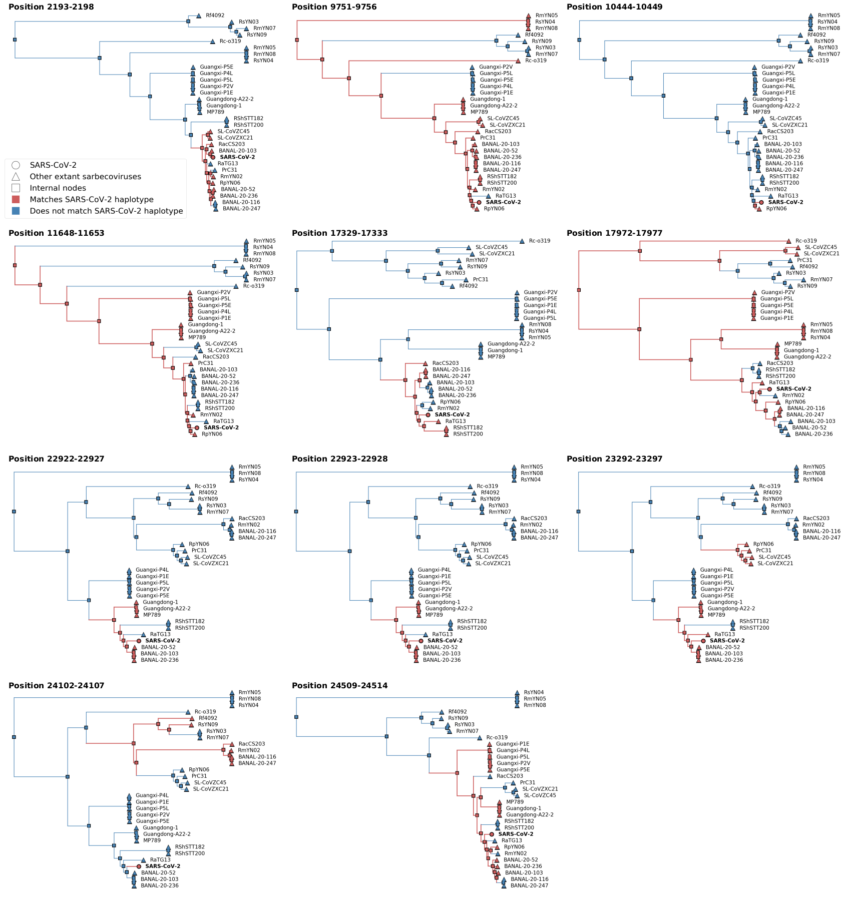

A BioRxiv preprint from [Bruttel et al.](https://www.biorxiv.org/content/10.1101/2022.10.18.512756v1) purportedly describes an ‘endonuclease fingerprint’ of SARS-CoV-2 of BsaI/BsmBI restriction endonuclease sites. BsaI/BsmBI cut sites are 6 nucleotides in length and occur naturally in most genomic sequences. Bruttel et al. claim to provide evidence that the distribution of BsaI/BsmBI cut sites in SARS-CoV-2 may have been subject to engineering: they propose that some may have been added, while others may have been removed, to create the genomic sequence of the SARS-CoV-2 virus as it existed at the start of the COVID-19 pandemic.

Over 28 SARS-CoV-2-like sarbecoviruses have been reported from both bats and pangolins. Across these close relatives of SARS-CoV-2, there is considerable variability in BsaI/BsmBI cut sites across the viral genome. **From this, we can see that the genotype of every SARS-CoV-2 BsaI/BsmBI cut site is observed in one or more other natural bat SARS2-like coronaviruses**. We can also see that this is true of sites “missing” in SARS-CoV-2 but present in other batCoVs: each “missing” site is also missing in other coronaviruses as well. 

Thus, the basic premise of the Bruttel et al. preprint is that a hypothetical engineer of the RE sites in SARS-CoV-2 *would have gone to enormous lengths to purposefully choose to introduce or remove cut sites using sequences that exactly match sarbecovirus genomes from bats*. This is despite the fact that prior to the pandemic, there were no published full length genomes of SARS-CoV-2-like coronaviruses, which have only since been reported by multiple international scientific teams. As far as I know, no such synthetic viral construct has ever been designed in this way, and it is unclear as to why an engineer would impose such a requirement, even if they did secretly possess genomes from the recently discovered and published genomes required to do so.

**We can further test this admittedly extraordinarily dubious premise using a phylogenetic approach.** As noted above, SARS-CoV-2 shares all of its BsaI/BsmBI cut sites with other viruses, but not the exact pattern with any one virus. This is true generally of its genome, and of all related coronavirus genomes, because of recombination: coronaviruses naturally recombine, and so their genomes are characterized by recombinant fragments, each with different ancestry.

Here, we perform phylogenetic inference reconstruction across 15 nonrecombinant regions of SARS-CoV-2 and closely related sarbecovirus genomes sampled from bats and pangolins (Temmam et al., 2022), and **we specifically masked the positions of all Bsal/BsmBI from each virus in the alignment to prevent these sites from influencing the phylogenetic inference**. We next performed ancestral state reconstruction (with the Bsal/BsmBl sites unmasked) to determine the evolutionary history of the 11 BsaI/BsmBI sites that Bruttel et al. propose were engineered in SARS-CoV-2: 5 present in SARS-CoV-2, 2 unique to BANAL-20-247, 2 unique to RaTG13, 1 shared by both BANAL-20-247 and RaTG13, and 2 shared by BANAL-20-247, RaTG13, and BANAL-20-52. These sites are those described in Figure 3A of Bruttel et al. under  “How to make SARS2”. Across these 11 cut sites are 66 residues, and the topologies indicate both the presence of all but one of the residues in SARS-CoV-2, its inferred common ancestor with bat coronaviruses, and closely related taxa. Furthermore, the gain and loss of these residues can be seen in the topologies, with these due to both recombination and mutation. 

From these results we can reach a number of conclusions:

1. **65/66 of the nucleotides in restriction enzyme cut-sites were already shared by the ancestor of SARS-CoV-2 and natural bat viruses**. This finding directly demonstrates the natural origin and evolution of 65 out of 66 of the sites proposed as candidates for engineering by Bruttel et al, and thus almost all of the endonuclease 'fingerprint'. The sequence in SARS-CoV-2 at these positions was not altered since ancestral recombination events with bat coronaviruses.

2. The masking of even all possible restriction enzyme cut sites in the alignment did not significantly alter local tree topologies. This is as expected, as the masked sites form approximately 1% of the total alignment, and an even smaller fraction of the segregating sites.

3. Further excluding the SARS-CoV-2 sequence had no impact on ancestral sequence reconstruction at any of the RE sites (compare trees in the folder ‘RecCA_excludeHu1’), with the exception of the missing BsaI site at 10444, which is [clearly recently shared with RpYN06 through a recombination event in this region](https://twitter.com/acritschristoph/status/1584219085239627779).

4. There was one final substitution in an RE site that did occur on the branch from the recombinant common ancestor to SARS-CoV-2. This was a synonymous substitution at position 24102, occurring at an arbitrary location in the spike gene. As can be seen in the tree of this region, this identical genotype has both been independently gained and lost in bat SARS2-like coronaviruses as well, indicating that this is a labile mutation. Further, the recombinant ancestor of SARS-CoV-2 is on average 1.27% diverged across the entire genome, and this single mutation reflects a 1.5% divergence rate within the proposed cut sites (1/66), and is therefore entirely in line with a neutral expectation of divergence. In addition, the arbitrary positioning of this mutation within the spike gene: neither near the gene boundaries, nor the S1/S2 boundary, make it an arbitrary candidate for having been engineered. Finally, any engineer wishing to make this mutation would have to have a sequenced version of one of the batCoVs that do, and copy it - supposedly doing so for the purpose of conservation- while simultaneously completely ignoring the lack of conservation of this site in most closely related CoVs (such as BANAL-20-52 or RaTG13). 
